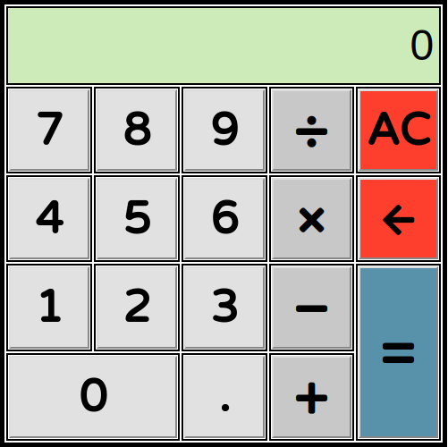
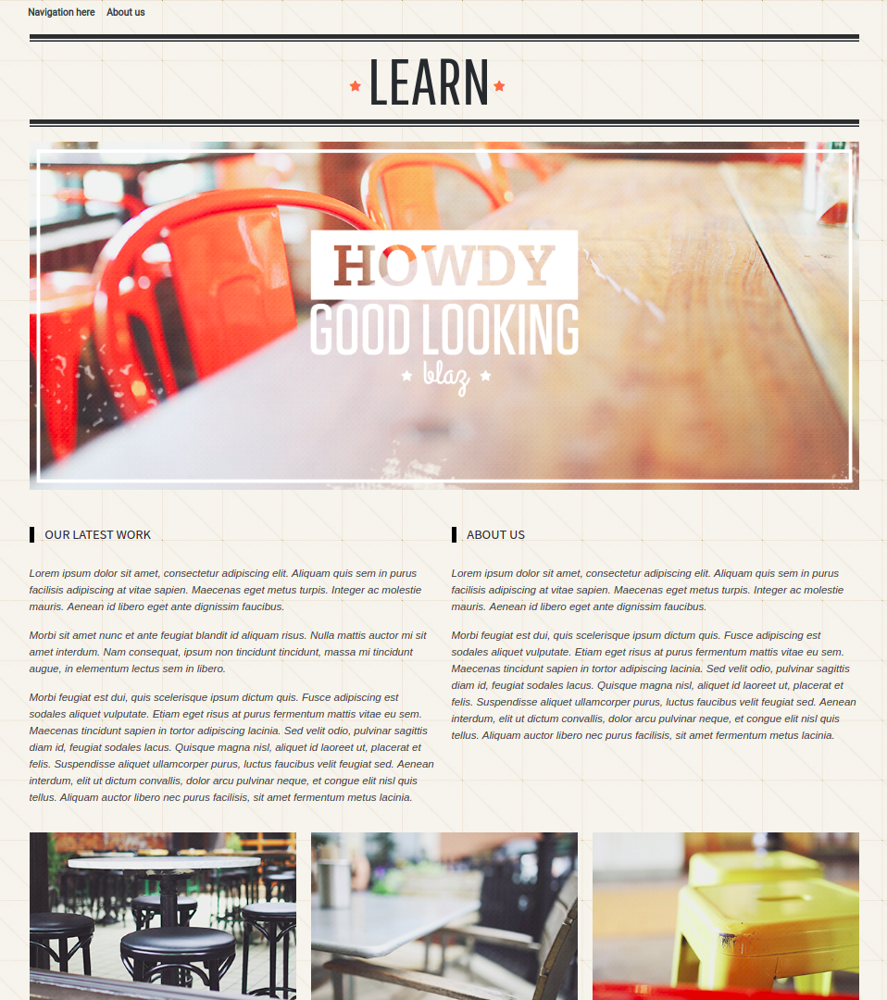

## Tarefa 1
Calculadora desenvolvida com JavaScript.

## Tarefa 2
Desenvolvimento do layout que será usado na tarefa 4 (desenvolvido com Bootstrap).

## Tarefa 3
Animação desenvolvida utilizando "Keyframes" (do CSS).

## Tarefa 4
Utilizando o Laravel, foi criada uma API para ser consumida e alimentar a página.

\* Foi desenvolvida mais uma versão, consome a API com Vue.js. 

